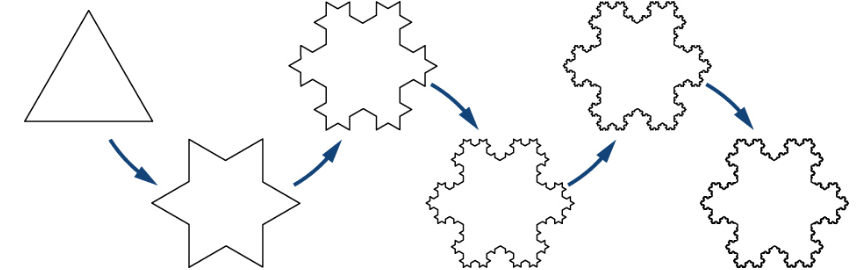

El fractal del copo de nieve se construye partiendo de un triángulo equilátero y alterando, de forma recursiva, cada segmento de línea de las siguiente manera:

1. Dividir el segmento de linea en tres partes iguales.
2. Dibujar hacia el exterior de la figura un triángulo equilátero a partir del segmento medio obtenido en el paso anterior. 
3. Borrar el segmento medio obtenido en el primer paso.

La siguiente figura ilustra el proceso para las 5 primeras iteraciones.

a. Estudiar la convergencia de la sucesión del número de lados. 
b. Estudiar la convergencia de la sucesión de la longitud de los lados.
c. Estudiar la convergencia de la sucesión del perímetro del copo de nieve.
d. Calcular el area del copo de nieve en la etapa $n$.
e. Calcular el area total del fractal del copo de nieve (cuando $n\to \infty$).

